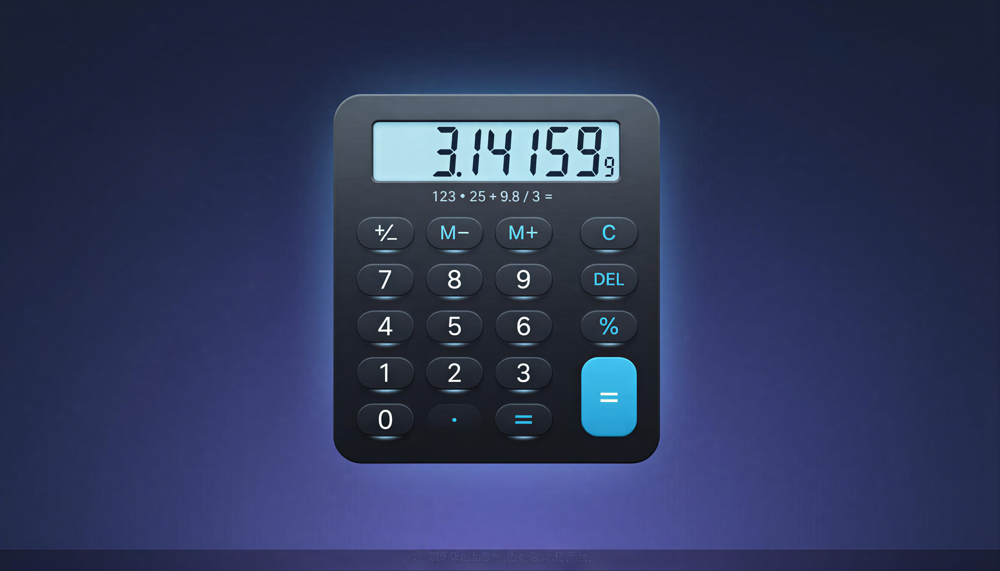
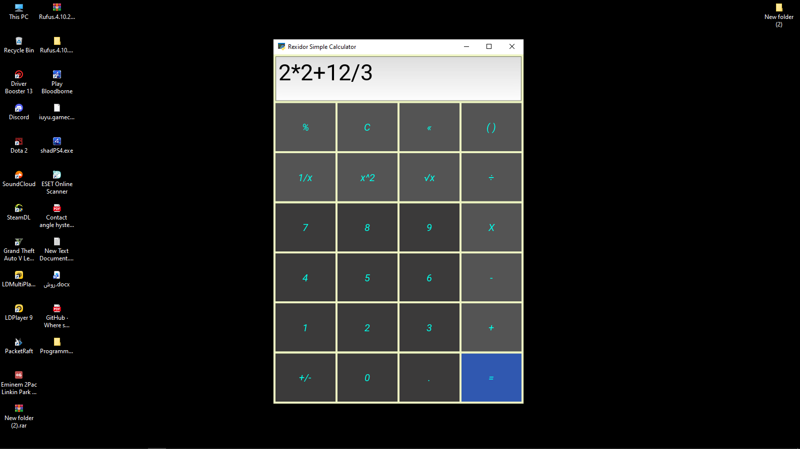

# CalcFlow

## 🚀 About the Project

**CalcFlow** is a modern and responsive calculator application built using the **Kivy** framework in Python. It provides all the essential arithmetic operations with a sleek, easy-to-use graphical user interface.

---

## 🖼️ Cover

<p align="center">
  
</p>

---

## ✨ Features

* Addition
* Subtraction
* Multiplication
* Division
* Clear/Reset Functionality
* Responsive GUI

---

## 🐍 Python Version Compatibility
✅ This project has been tested and verified with Python 3.10 and works reliably with this version.
⚠️ Using newer or older Python versions may cause compatibility issues with Kivy.

---

## 📸 Screenshots

Here are a few screenshots of the CalcFlow application:
<p align="center">
  
</p>

<p align="center">
  
</p>


---

## 🛠️ Installation

To set up CalcFlow on your local machine, follow these steps:

1. **Clone the repository:**
```bash
git clone https://github.com/YourUsername/CalcFlow.git
cd CalcFlow

```


2. **Create and activate a virtual environment** (recommended):
```bash
python -m venv venv
# On Windows
venv\Scripts\activate
# On Linux/macOS
source venv/bin/activate

```


3. **Install the requirements:**
```bash
pip install -r requirements.txt

```


4. **Run the application:**
```bash
python main.py

```


---

## 📄 License

This project is licensed under the **MIT License**. See the `LICENSE` file for more details.

---
---


## 🚀 درباره پروژه

**CalcFlow** یک برنامه ماشین حساب مدرن و واکنش‌گرا است که با استفاده از فریم‌ورک **Kivy** در پایتون ساخته شده است. این برنامه تمام عملیات‌های ضروری حسابی را با یک رابط کاربری گرافیکی زیبا و آسان ارائه می‌دهد.

---
## 🖼️ تصویر کاور

<p align="center">
  
</p>

## ✨ امکانات

* جمع
* تفریق
* ضرب
* تقسیم
* عملکرد پاک کردن/بازنشانی
* رابط کاربری گرافیکی واکنش‌گرا

---

## 🐍 سازگاری نسخه پایتون
✅ این پروژه با Python نسخه 3.10 تست شده و به‌صورت پایدار اجرا می‌شود.
⚠️ استفاده از نسخه‌های جدیدتر یا قدیمی‌تر پایتون ممکن است باعث بروز مشکلات سازگاری با Kivy شود.


---

## 📸 تصاویر صفحه (Screenshots)

در اینجا چند تصویر از برنامه CalcFlow مشاهده می‌کنید:
<p align="center">
  
</p>

<p align="center">
  
</p>

---

## 🛠️ نصب و راه‌اندازی

برای راه‌اندازی CalcFlow بر روی سیستم محلی خود، مراحل زیر را دنبال کنید:

1. **کلون کردن مخزن (Repository):**
```bash
git clone https://github.com/YourUsername/CalcFlow.git
cd CalcFlow

```


2. **ایجاد و فعال‌سازی محیط مجازی** (توصیه می‌شود):
```bash
python -m venv venv
# در ویندوز
venv\Scripts\activate
# در لینوکس/مک‌اواس
source venv/bin/activate

```


3. **نصب پیش‌نیازها:**
```bash
pip install -r requirements.txt

```


4. **اجرای برنامه:**
```bash
python main.py

```


---

## 📄 مجوز (License)

این پروژه تحت **مجوز MIT** منتشر شده است. برای جزئیات بیشتر، فایل `LICENSE` را ببینید.

---
